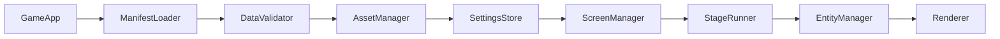

# Danmaku Engine v0.1 技術仕様

## 1. 設計目標

Danmaku Engine v0.1は、作品固有の画像・音声・文章・敵配置・弾幕を**データとして外出し**し、ゲームシステムの再実装なしに別作品を制作するための2D弾幕シューティング基盤です。ゲームロジックはES Modulesで実装し、コンテンツ定義はJSONで記述します。開発中はブラウザで動作させ、販売用には同じファイル群をデスクトップランタイムから読み込みます。

本仕様は、ゲームの挙動を次の4層に分けます。

| 層 | 配置先 | 変更頻度 | 役割 |
|---|---|---:|---|
| Engine | `src/core/` | 低 | ループ、入力、描画、衝突、乱数、プール、保存 |
| Gameplay | `src/gameplay/` | 中 | 自機・敵・弾・アイテム・ボス・スコアの共通挙動 |
| Content Runtime | `src/content/` | 中 | 定義の検証、読込、ステージ進行、弾幕イベント実行 |
| Game Pack | `game-data/` と `assets/` | 高 | 作品ごとの定義、画像、音声、テキスト |

## 2. ディレクトリ規約

```text
space-shooter-engine/
├── assets/
│   ├── audio/                 # 作品固有のBGM・SE
│   ├── images/                # スプライト、背景、UI画像
│   └── fonts/                 # 商用利用可能なフォントのみ
├── game-data/
│   ├── manifest.json          # 作品名、画面設定、アセット表
│   ├── player.json            # 自機とショット種別
│   ├── bullets.json           # 敵弾・自弾の見た目と物理値
│   ├── enemies.json           # 敵・ボスの耐久、移動、弾幕参照
│   ├── patterns.json          # 弾幕イベント定義
│   ├── stages/                # ステージのタイムライン
│   └── text/ja.json           # 作品固有の表示文
├── src/
│   ├── core/                  # 作品を問わない基盤
│   ├── gameplay/              # 共通ゲームルール
│   ├── content/               # JSON読込と実行
│   ├── ui/                    # タイトル、設定、HUD、結果
│   └── main.js                # 起動と依存関係の組立て
├── electron/                  # 販売版デスクトップラッパー
├── docs/                      # 設計、制作、リリース文書
├── index.html                 # ブラウザ開発用エントリ
├── styles.css                 # UIテーマ
└── package.json               # 開発・配布コマンド
```

`src/`のコードは作品固有の名称・数値・ファイル名を直接参照してはいけません。作品固有の値は常にゲームパックから取得します。この規約を守ることで、同じエンジンに別の `game-data` と `assets` を配置するだけで派生作品を開始できます。

## 3. 起動シーケンス

起動時、`GameApp`はマニフェストを読み込み、データを検証し、アセットと設定を初期化します。その後、タイトル画面を表示します。プレイ開始時には指定ステージのタイムラインを開始し、ゲームループは固定更新と描画を分離して実行します。



### 3.1 更新ルール

ゲーム内の単位はピクセルと秒とします。内部更新は1/60秒の固定ステップを基準とし、描画は `requestAnimationFrame` に同期します。表示フレームが遅延した場合でも、1回の描画で処理する更新回数に上限を設け、極端な追いつき処理を防止します。

### 3.2 ランダム性

ステージ中の敵配置・弾幕には、ゲーム開始時に生成したシード付き乱数を使用します。通常のプレイではランダムなシードを採用しますが、デバッグ時には固定シードを指定できるようにします。これにより、同じ状況を再現して弾幕を調整できます。

## 4. 入力仕様

全ての操作はアクション名に変換して扱います。ゲームロジックは物理キーを直接参照せず、`InputManager`からアクション状態を取得します。キーボード・ゲームパッド・将来の独自コントローラを同じアクションに割り当てられます。

| アクション | 初期キーボード | 初期ゲームパッド | 用途 |
|---|---|---|---|
| `moveUp` | ArrowUp / W | 左スティック上 | 移動 |
| `moveDown` | ArrowDown / S | 左スティック下 | 移動 |
| `moveLeft` | ArrowLeft / A | 左スティック左 | 移動 |
| `moveRight` | ArrowRight / D | 左スティック右 | 移動 |
| `focus` | Shift | LB | 低速移動・当たり判定表示 |
| `shot` | Z / Space | A | メインショット |
| `bomb` | X | B | ボム |
| `confirm` | Enter / Z | A | 決定 |
| `cancel` | Escape / X | B | 戻る・ポーズ |

## 5. 当たり判定仕様

弾幕ゲームの視認性を保つため、描画サイズと当たり判定サイズは分離します。自機の当たり判定は円形、敵弾とアイテムは円形、敵は円または矩形を使用します。初期版ではすべて円形判定を標準とし、必要な場合のみ矩形を追加します。

| 対象 | 判定 | 重要なルール |
|---|---|---|
| 自機 | 円 | 描画より小さく、低速時に可視化可能 |
| 自弾 | 円 | 敵の被弾領域に接触でダメージ |
| 敵弾 | 円 | 自機の被弾領域に接触でミス |
| 敵 | 円または矩形 | 自機接触時は原則ミス、必要に応じて接触ダメージ |
| アイテム | 円 | 自機の取得範囲に接触で回収 |

衝突判定はカテゴリ別に実行します。すなわち「自弾×敵」「敵弾×自機」「敵×自機」「自機×アイテム」のみを比較し、不要な総当たりを避けます。弾数が増える場面ではグリッド分割による空間インデックスを追加できる設計とします。

## 6. コンテンツ定義仕様

### 6.1 マニフェスト

`manifest.json`はゲームパックの入口です。タイトル、バージョン、画面設定、エントリステージ、初期設定、アセットの論理名を定義します。

```json
{
  "id": "com.example.danmaku-demo",
  "title": "Danmaku Engine Demo",
  "version": "0.1.0",
  "locale": "ja",
  "display": { "width": 1280, "height": 720, "fieldWidth": 540, "fieldHeight": 720 },
  "entryStage": "stage_demo_01",
  "dataFiles": {
    "player": "player.json",
    "bullets": "bullets.json",
    "enemies": "enemies.json",
    "patterns": "patterns.json"
  },
  "stages": ["stages/stage_demo_01.json"]
}
```

### 6.2 自機定義

自機は移動速度、低速時の移動速度、残機、ボム、被弾時間、ショット種別を定義します。ショットの各発射口・威力・間隔は `shots` 配列で表し、低速時は `focusShots` に置き換えます。

```json
{
  "id": "reimu_demo",
  "hitboxRadius": 3,
  "moveSpeed": 280,
  "focusSpeed": 130,
  "lives": 3,
  "bombs": 3,
  "shots": [{"bullet": "player_needle", "offsetX": 0, "offsetY": -20, "interval": 0.08}],
  "focusShots": [
    {"bullet": "player_needle", "offsetX": -12, "offsetY": -20, "interval": 0.08},
    {"bullet": "player_needle", "offsetX": 12, "offsetY": -20, "interval": 0.08}
  ]
}
```

### 6.3 弾定義

弾は論理名をキーにして、見た目・速度・半径・ダメージ・色・消去可能性を定義します。画像が未指定の場合、エンジンは図形描画で代替します。これにより正式な画像を用意する前から弾幕と当たり判定を調整できます。

```json
{
  "enemy_orb_red": {
    "team": "enemy",
    "shape": "orb",
    "radius": 8,
    "hitboxRadius": 4,
    "speed": 160,
    "color": "#ff526f",
    "damage": 1,
    "graze": true,
    "cancelable": true
  }
}
```

### 6.4 敵定義

敵は耐久、被弾範囲、得点、出現位置の既定値、移動スクリプト、弾幕パターンを持ちます。ボスはフェーズ配列を持ち、各フェーズに耐久・制限時間・弾幕を定義します。

```json
{
  "fairy_red": {
    "kind": "enemy",
    "hp": 20,
    "hitboxRadius": 18,
    "score": 500,
    "movement": {"type": "line", "velocity": [0, 90], "duration": 3.0},
    "patterns": ["fairy_fan"]
  }
}
```

### 6.5 弾幕パターン定義

初期版の弾幕は、時刻に対して実行するイベントの配列として記述します。パターンの実行開始時刻を0秒とし、`repeat` と `interval` で繰り返しを表現します。ゲームエンジン本体を編集することなく、扇状・円形・狙い撃ち・螺旋の基礎弾幕を制作できます。

| `action` | 必須属性 | 動作 |
|---|---|---|
| `fan` | `bullet`, `count`, `angle`, `spread`, `speed` | 中心角を基準に扇状発射 |
| `ring` | `bullet`, `count`, `speed`, `angle` | 360度に等間隔で発射 |
| `aimed` | `bullet`, `speed` | 自機の現在位置へ発射 |
| `spiral` | `bullet`, `count`, `speed`, `rotation` | 回転角を進めつつ円形に発射 |
| `clearBullets` | なし | 指定発射者の敵弾を消去 |

```json
{
  "fairy_fan": {
    "loop": true,
    "duration": 3.6,
    "events": [
      {
        "at": 0.3,
        "repeat": 8,
        "interval": 0.36,
        "action": "fan",
        "bullet": "enemy_orb_red",
        "count": 5,
        "angle": 90,
        "spread": 72,
        "speed": 150
      }
    ]
  }
}
```

角度は右方向を0度、下方向を90度とする画面座標系を採用します。`aimed`と`fan`は必要に応じて自機の座標を基準に補正できます。

### 6.6 ステージ定義

ステージはタイムラインで敵・ボス・BGM・背景・会話を制御します。`at`はステージ開始からの秒数です。敵出現は `spawn`、ボス戦開始は `boss`、BGM切替は `music` で表します。`clear`条件はボス撃破または指定秒数の生存とします。

```json
{
  "id": "stage_demo_01",
  "title": "Engine Demonstration",
  "music": "bgm_stage",
  "timeline": [
    {"at": 1.0, "type": "spawn", "enemy": "fairy_red", "x": 120, "y": -30},
    {"at": 2.5, "type": "spawn", "enemy": "fairy_red", "x": 420, "y": -30},
    {"at": 18.0, "type": "boss", "enemy": "boss_demo", "x": 270, "y": 120}
  ],
  "clear": {"type": "bossDefeat"}
}
```

## 7. アセット規約

アセットは論理名とファイルパスを分離します。コードやステージ定義に直接ファイルパスを書かず、`manifest.json`の `assets` から参照します。同じ論理名に別ファイルを割り当てれば、世界観を差し替えてもゲームロジックは変更不要です。

| 種別 | 推奨形式 | 用途 |
|---|---|---|
| スプライト | PNG（透過） | 自機、敵、弾、UI |
| 背景 | PNG / WebP | ステージ背景 |
| BGM | OGG または MP3 | ループ再生する楽曲 |
| SE | WAV または OGG | 低遅延の効果音 |
| フォント | WOFF2 | ライセンス確認済みの画面用フォント |

正式アセットがない間は、`shape`、`color`、`radius`に基づく図形描画を使用します。仮素材のまま商用販売は行わず、リリース前に各アセットの権利台帳を作成します。

## 8. セーブデータ仕様

セーブデータはローカル環境にJSONで保存し、作品IDとスキーマバージョンを必ず記録します。初期版では設定、ハイスコア、既読・解放状態を保存します。セーブ内容の変更時はマイグレーションを提供し、旧バージョンの利用者が設定を失わないようにします。

```json
{
  "schemaVersion": 1,
  "gameId": "com.example.danmaku-demo",
  "settings": {"bgm": 0.8, "se": 0.9, "fullscreen": false},
  "records": {"stage_demo_01": {"highScore": 0, "cleared": false}},
  "unlocks": []
}
```

## 9. テスト可能性とデバッグ機能

開発版ではデバッグオーバーレイを使用できるようにします。オーバーレイではFPS、更新時間、弾数、敵数、プレイヤー当たり判定、固定シードを表示します。タイトルからステージを直接開始できるデバッグメニューも持たせます。リリースビルドでは設定で無効化し、プレイヤーにデバッグ情報を表示しません。

## 10. 受入基準

Engine Demo v0.1は、次の基準を満たした時点でコア実装完了とします。

| ID | 受入基準 |
|---|---|
| E-01 | `game-data` の自機・敵・弾・弾幕・ステージ定義を読み込める。 |
| E-02 | 定義変更のみで、直線・扇・円形・狙い撃ち・螺旋の弾幕を変更できる。 |
| E-03 | 自機の通常移動、低速移動、ショット、ボム、ミス、無敵時間を実装する。 |
| E-04 | グレイズ、スコア、残機、ボム、コンティニュー、リザルトを実装する。 |
| E-05 | BGM・SEを論理名から再生し、設定画面で音量を保存できる。 |
| E-06 | タイトル、ステージ選択、設定、ポーズ、リザルトを提供する。 |
| E-07 | Web開発版で遊べ、Windows配布用にパッケージ化できる。 |

## 11. 作品派生の制作手順

新作を作る際は、まず既存基盤を複製して新しい作品IDを設定します。次に、アセット台帳を作り、`assets/`へ正規素材を配置します。最後に `game-data/` のマニフェスト、テキスト、自機、弾、敵、弾幕、ステージを順番に差し替えます。CoreとGameplayへ変更が必要になった場合は、特定作品向けの例外を埋め込む前に、共通機能として一般化できるかを検討します。
